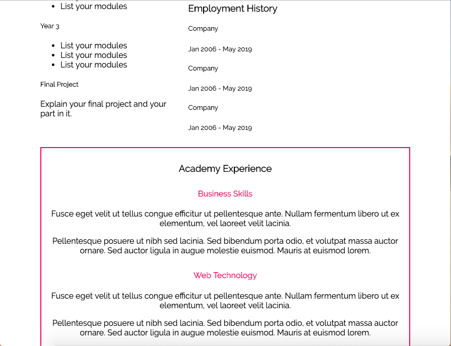
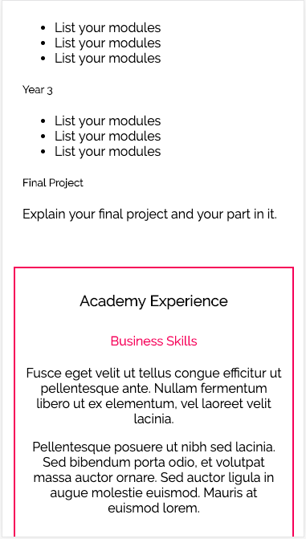
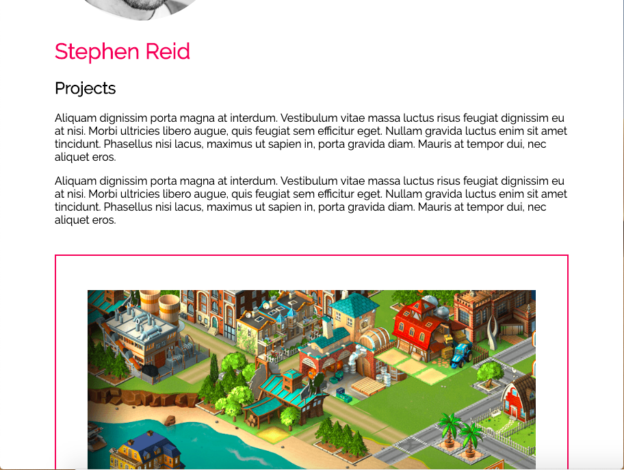
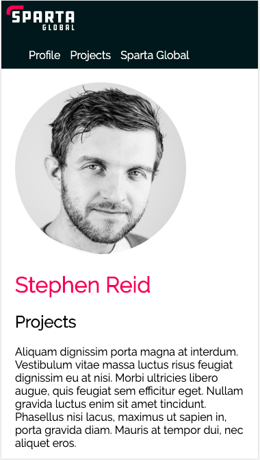

# CSS Media Queries Lab

## Summary

Starting from an unresponsive CSS layout of Steve's profile, I created a responsive version of both pages on the site. This was done with altering the three pre-existing stylsheets only, and making no alterations to the orginal HTML.

The scaling for this project was mainly done by introducing media queries for specific screen widths and resolutions. One of the queries scaled the website for optimum use on the iPhone 6/7/8, as can be seen below:

**Profile:**








**Projects:**








The css code for these media queries were as follows:


**CSS - gloabl.css**

```CSS
/* Media query - iPhone 6/7/8 */

@media screen and (max-width: 375px) {
  #logo {
    width:100px;
    margin:7px;
  }

  .main-content {
    margin: 20px;
  }
}

/* Media query - scaling */

@media screen and (min-width: 376px) and (max-width: 850px) {
  #logo {
    width:100px;
    margin:7px;
  }
}
```


**CSS - index.css**

```CSS
/* Media query - iPhone 6/7/8 */

@media screen and (max-width: 375px)  {
  header {
    display: inline-block;
    width: 320px;
    position: relative;
    margin: -6px;
    padding-left: 15px;
  }

  .left {
    float: left;
    width: 100%;
    margin: 20px 5px;
  }

  .right {
    float: right;
    width: 100%;
    margin: 20px 5px;
  }

  #headshot {
    display: block;
    text-align: center;
    margin: 20px auto 0;
    border: 2px solid #E13A63;
  }

  .experience {
    width: 325px;
    position: relative;
    margin: 20px -6px;
    display: inline-block;
    clear: both;
    text-align: center;
  }
}

/* Media query for general screen scaling. */

@media screen and (min-width: 376px) and (max-width: 850px) {
  header {
    display: inline-block;
    width: 100%;
    position: relative;
    padding-left: 15px;
  }

  .left {
    width: 100%;
    margin: 20px 5px;
  }

  .right {
    width: 100%;
    margin: 20px 5px;
  }

  .experience {
    width: 100%;
    position: relative;
    display: inline-block;
    clear: both;
    text-align: center;
  }
}
```


**CSS - projects.css**

```CSS
/* Media query - iPhone 6/7/8 */
@media screen and (max-width: 375px) {
  .tile {
    display: block;
    width: 100%;
    text-align: center;
    border: 2px solid #E13A63;
    padding: 10px;
  }
}

/* Media query - scaling */

@media screen and (min-width: 376px) and (max-width: 972px) {
  .screenshot {
    padding-top:30px;
    height: 90%;
    width: 90%;
  }

  .tile {
    display: inline-block;
    width: 100%;
    padding: 10px;
    margin-top: 25px;
    text-align: center;
    border: 2px solid #E13A63;
    box-sizing: border-box;
    clear: both;
  }

  .tile img	{
    display: block;
    margin: 10px auto;
  }
}

@media screen and (min-width: 973px) {
  .screenshot {
    padding-top:30px;
    height: 90%;
    width: 90%;
  }

  .tile {
    display: inline-block;
    width: 30%;
    padding: 10px;
    margin-top: 25px;
    text-align: center;
    border: 2px solid #E13A63;
    box-sizing: border-box;
    overflow-x: hidden;
  }
}
```
